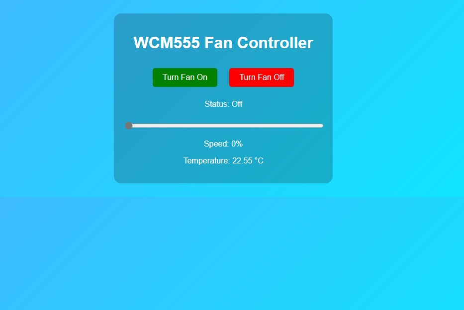

## Project Interface

Below is a screenshot of the fan control web interface:



# Web-Based Fan Controller using Raspberry Pi

This IoT project allows users to control a fan remotely using a web interface built with Flask, Python, and Raspberry Pi GPIO PWM signals.

## Features
- Wi-Fi based fan ON/OFF control
- Real-time PWM speed adjustment (0%–100%)
- Lightweight Flask server with AJAX functionality
- GPIO pin management and PWM signal generation
- (Optional) TMP36 sensor integration

## Technologies Used
- Python 3
- Flask
- RPi.GPIO library
- HTML5, CSS3, JavaScript (AJAX)

## Setup Instructions
1. Install the required Python packages:
   ```bash
   pip install -r requirements.txt
   ```

2. Run the application:
   ```bash
   python app.py
   ```

3. Access the fan controller UI by visiting:
   ```
   http://<your-raspberrypi-ip>:5000/fanControl
   ```

## Notes
- Ensure you have the necessary GPIO permissions (`sudo` if needed).
- Tested on Raspberry Pi 4 with Raspberry Pi OS Lite (64-bit).

## Author
Saket Chahal
